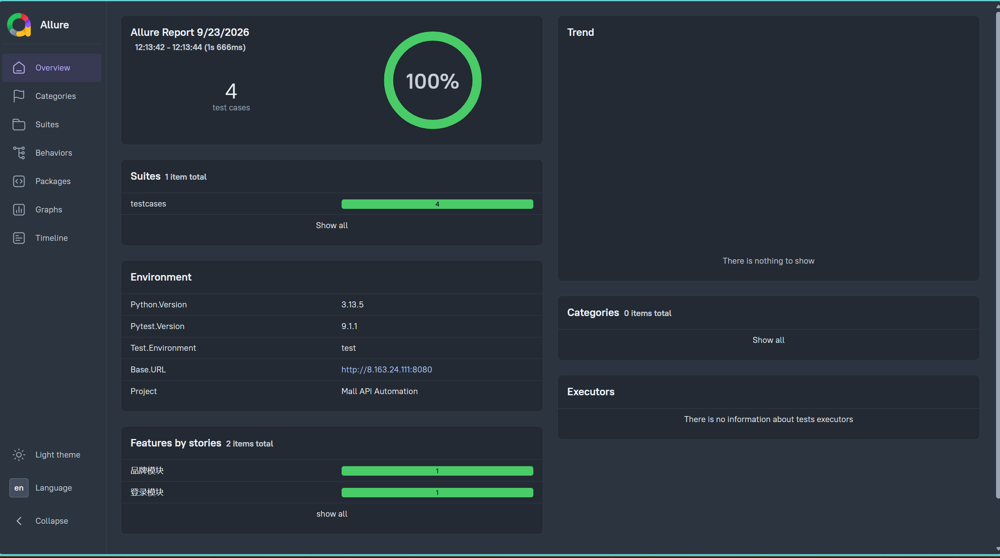
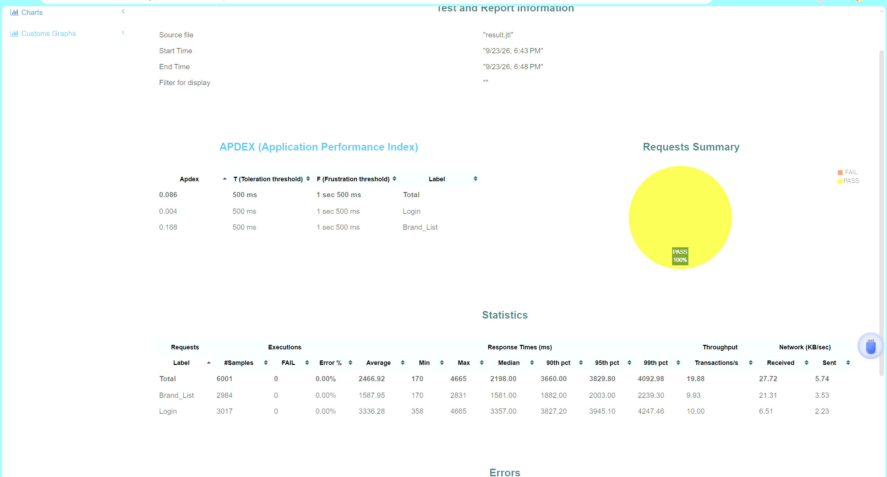

# Mall 电商系统接口自动化测试

## 技术栈
- Python 3.13
- Requests + Pytest + YAML + Allure
- 被测系统：Mall 电商系统（Docker 部署）

## 项目结构
```
02-Mall-testing/
├── common/              # 请求封装、接口封装、环境配置
├── data/                # YAML 测试数据（含 Schema 定义）
├── testcases/           # 测试用例
├── report/              # Allure 报告输出目录
├── performance/         # 性能测试目录
│   ├── mall_performance.jmx  # JMeter 压测脚本
│   ├── result.jtl            # 压测原始数据
│   ├── html_report/          # JMeter HTML 压测报告
│   └── README.md             # 性能测试报告
├── conftest.py          # pytest 钩子 + db_util fixture
├── pytest.ini           # pytest 配置
└── requirements.txt
```

## 如何运行
```bash
pip install -r requirements.txt
pytest testcases/ -v
pytest --alluredir=./report/allure-results
allure serve ./report/allure-results
```

## 已覆盖接口
| 模块 | 接口 | 用例数 | 场景 |
|------|------|--------|------|
| 登录 | POST /admin/login | 2 | 正常登录、密码错误 |
| 品牌 | GET /brand/list | 2 | 第1页、第2页 |

## 测试结果
- 4 个用例全部通过
- Allure 报告已生成

## 环境信息
- 被测系统：http://8.163.24.111:8080
- 部署方式：Docker Compose（Mall 电商系统）
## 项目演进（体现你的成长）
- **阶段一**：云端基础环境搭建与 OSS 对象存储手工测试。
- **阶段二**：基于 Python + Pytest 搭建 Mall 系统接口自动化框架，实现 HTTP 状态码 + JSON Schema + 数据库一致性“三层断言”。
- **阶段三**：使用 JMeter 进行 50 并发 5 分钟长稳压测，输出专业性能测试报告，TPS 达到 19.88，错误率 0%。

## 测试报告截图


