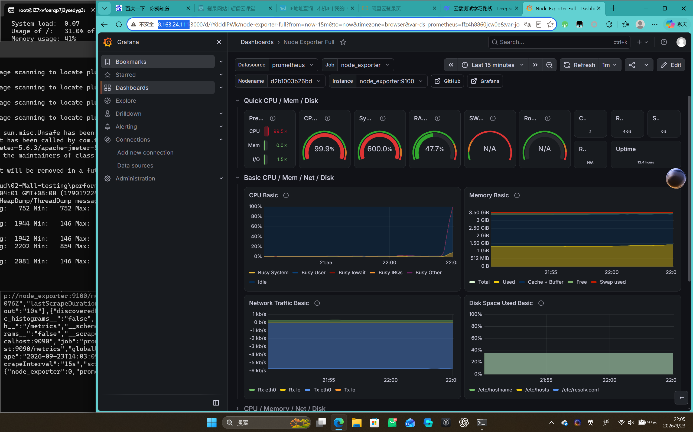

### ✅ 最终修正版（请直接复制全量替换）：

```markdown
# 云端测试工程师作品集 (Cloud QA Portfolio)

本项目记录了我为模拟云端 SaaS 产品（Mall 电商系统）建立完整质量保障体系的全过程。项目涵盖了从云端基础设施手工测试、接口自动化、性能压测与监控、CI/CD 流水线搭建，到线上故障复盘与混沌工程演练的完整闭环。

## 🏗️ 架构概览
整个测试体系的核心流程如下：
`代码 Push` -> `Jenkins 自动拉取` -> `安装虚拟环境` -> `安全凭据注入` -> `执行 Pytest 自动化` -> `生成 Allure 报告` -> `上线部署` -> `Grafana 监控与混沌演练`

## 🛠️ 技术栈

*   **云端基础设施**：阿里云 ECS (Ubuntu 22.04)、阿里云 OSS、Swap 内存优化
*   **容器化与编排**：Docker、Docker Compose
*   **接口自动化**：Python 3.13、Requests、Pytest、YAML、JSON Schema、PyMySQL
*   **测试报告**：Allure Report
*   **性能测试与监控**：Apache JMeter (CLI模式)、Prometheus、Grafana、Node Exporter
*   **CI/CD 持续集成**：Jenkins (Pipeline)、Git、GitHub
*   **混沌工程与质量保障**：故障注入、容器自愈验证、故障复盘

## 📁 项目结构

```text
cloud-server-test-cases/
├── 01-cloud-infra-testing/          # 阶段一：云端基础环境与手工测试
│   └── cloud-test-cases.md          # Nginx/OSS 测试用例集（含安全、异常、性能场景）
├── 02-Mall-testing/                 # 阶段二至五：Mall 系统全链路测试
│   ├── common/                      # 核心封装层
│   │   ├── request_util.py          # HTTP 请求封装（含日志、耗时统计、异常处理）
│   │   ├── db_util.py               # 数据库连接封装
│   │   ├── assert_util.py           # JSON Schema 断言工具
│   │   ├── brand_api.py / login_api.py # 业务接口封装
│   │   └── config.yaml.example      # 环境配置模板（真实 config.yaml 已被 .gitignore）
│   ├── data/                        # 测试数据驱动
│   │   ├── schema/                  # JSON Schema 结构定义
│   │   ├── brand_data.yaml          # 品牌模块测试数据
│   │   └── login_data.yaml          # 登录模块测试数据
│   ├── testcases/                   # 测试用例代码
│   │   ├── test_brand.py            # 品牌列表接口测试（含数据库一致性校验）
│   │   └── test_login.py            # 登录接口测试
│   ├── performance/                 # 阶段三：性能测试
│   │   ├── mall_performance.jmx     # JMeter 压测脚本
│   │   ├── html_report/             # JMeter HTML 压测报告
│   │   └── README.md                # 专业性能测试报告（含瓶颈分析与优化建议）
│   ├── fault_report/                # 阶段五：线上质量保障
│   │   └── 2026-09-24-数据库容器宕机故障复盘.md # 故障复盘报告
│   ├── report/                      # Allure 结果输出目录
│   ├── conftest.py                  # pytest 钩子（环境注入、DB fixture）
│   ├── pytest.ini                   # pytest 配置文件
│   ├── Jenkinsfile                  # Jenkins Pipeline 脚本
│   └── requirements.txt             # 依赖包（已锁定版本）
├── assets/                          # 测试报告截图与监控图表
│   ├── Allure-report.png
│   ├── jmeter_statistics.png
│   ├── ThroughPut.png
│   ├── Response_time.png
│   └── grafana_monitor.png
└── .gitignore                       # 忽略敏感配置、日志和临时文件
```

## 🚀 项目演进与核心成果

### 阶段一：云端基础环境与手工测试
*   **内容**：在阿里云 ECS 上搭建 Nginx + MySQL 环境。针对 Nginx 和 OSS 对象存储进行功能、异常、性能（`ab` 压测）、安全（SQL注入、路径遍历）测试。
*   **成果**：输出了包含 13 个场景的测试用例集，并在 OSS 大文件分片上传、私有 Bucket 签名机制上积累了实战排错经验。

### 阶段二：接口自动化测试框架
*   **内容**：基于 Python + Pytest + Requests + YAML 搭建分层自动化框架。
*   **亮点**：
    *   **三层断言机制**：不再仅校验 HTTP 状态码，而是加入了 **JSON Schema 结构校验** 和 **MySQL 数据库数据一致性校验**，彻底杜绝“接口返回成功但数据未落库”的伪成功。
    *   利用 `conftest.py` 实现 Session 级别的数据库连接自动管理与释放。
    *   敏感配置通过环境变量注入（`config.yaml.example` 提供模板）。

### 阶段三：性能测试与监控体系建设
*   **内容**：使用 JMeter 命令行模式对 Mall 系统进行 50 并发、持续 5 分钟的长稳测试，并部署 Prometheus + Grafana + Node Exporter 监控服务器资源。
*   **成果**：
    *   总请求数 6001，错误率 0%，总 TPS 19.88。
    *   通过 Grafana 监控定位到 CPU 峰值飙升至 **99.5%**，系统负载高达 **600%**，精准定位到 2核4G 服务器的算力瓶颈。
    *   输出了包含 APDEX 分析、瓶颈定位及优化建议的专业性能测试报告。

### 阶段四：CI/CD 持续集成与自动化落地
*   **内容**：在云服务器上基于 Docker 部署 Jenkins，编写 Declarative Pipeline。
*   **亮点**：
    *   实现“代码 Push -> 自动拉取 -> 虚拟环境隔离 -> 依赖安装 -> 执行测试 -> 生成 Allure 报告”的完整自动化闭环。
    *   利用 Jenkins Credentials 结合 `withCredentials` 语法注入数据库密码，实现日志自动打码，确保 CI/CD 过程中的密码安全。

### 阶段五：线上质量保障与混沌工程
*   **内容**：模拟线上 MySQL 容器宕机故障，排查问题并撰写《线上故障复盘报告》。
*   **成果**：
    *   定位根因为服务器内存不足导致 OOM Killer 杀死了 MySQL 容器。
    *   **实施修复**：为所有核心容器配置 `restart: always` 自愈策略；创建并挂载 2GB Swap 分区并写入 `/etc/fstab`。
    *   进行架构权衡：评估测试服务器资源后，选择在 Docker 架构下进行轻量级故障注入而非部署 K8s，完成故障闭环，提升系统鲁棒性。

## 💻 快速开始

1.  **环境准备**：确保本地或服务器已安装 Python 3.13 及依赖。
2.  **配置环境**：复制 `02-Mall-testing/common/config.yaml.example` 并重命名为 `config.yaml`，填入真实的数据库和被测系统信息。
3.  **安装依赖**：
    ```bash
    cd 02-Mall-testing
    pip install -r requirements.txt
    ```
4.  **运行测试并生成报告**：
    ```bash
    pytest testcases/ -v --alluredir=./report/allure-results
    allure serve ./report/allure-results
    ```

## 📸 测试报告展示
*   **接口自动化报告 (Allure)**：
*   **性能压测报告 (JMeter)**：
*   **服务器资源监控 (Grafana)**：

---
*注：本项目仅用于技术展示与学习，所有敏感信息均已脱敏处理。*
```

